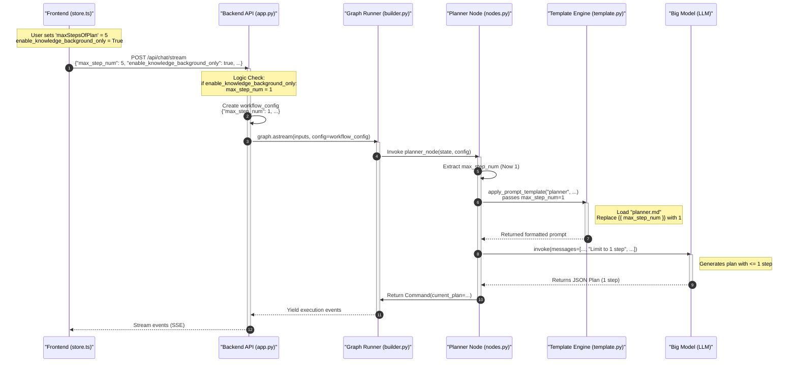

# Modification Plan: Enforce Single-Step Plan for Knowledge Background Mode

## Overview
When `enable_knowledge_background_only` is enabled, the system should strictly limit the planning to 1 step, regardless of the user's `maxStepsOfPlan` setting. This ensures the researcher focuses on a single retrieval-and-answer cycle (RAG) rather than complex multi-step planning.

## Proposed Changes

### Backend Logic (`src/server/app.py`)
Modify the `chat_stream` endpoint to check for `enable_knowledge_background_only` in the request. If true, override `max_step_num` to `1` before initializing the workflow.

## Updated System Flow

The following sequence diagram illustrates the modified flow where the Backend API ensures the step limit is enforced.

